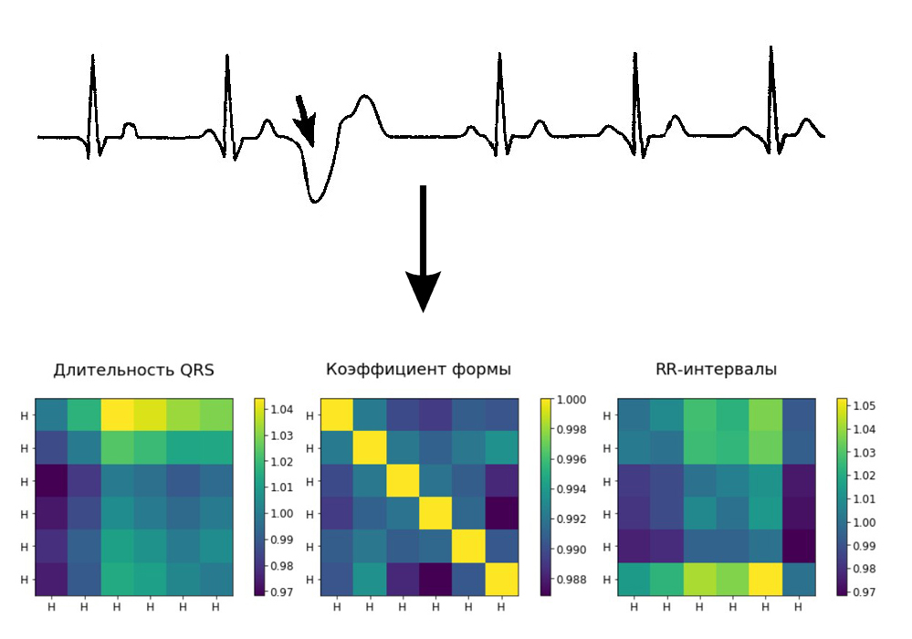
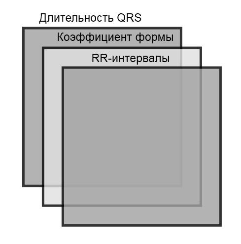

# Нейросетевой алгоритм анализа нарушений сердечного ритма на основе матрицы признаков ЭКГ

- Разработанный алгоритм производит классификацию событий в сигнале ЭКГ с помощью метода, основанного на матрице признаков.
- Cозданы средства извлечения признаков из сигнала ЭКГ и исследована информативность представления нарушений сердечного ритма в форме матрицы признаков.
- Обучающая выборка сформирована на основе баз данных MIT: BIH, Arrhythmia, MGH/MF и содержит более 140 часов записей ЭКГ сигнала.
- Использованы алгоритмы машинного обучения: CNN, FCNN ensemble, Random Forest, CatBoost. 
- Модели оптимизировались с помощью GridsearchCV для достижения лучшего результата. 

# Ресурсы
**Python Version:** 3.6.8

**Packages:** pandas, numpy, scipy, pytorch, sklearn, catboost, matplotlib, seaborn, h5py

# Ключевые идеи
- **Матрица признаков** определяется для набора сокращений, в котором для каждого из них поставлено в соответствие значение определенного признака. Матрица представляет собой двумерный тензор, где каждый элемент получен путем деления признака i-го сокращения на признак j-го сокращения:

- Сформированы трехмерные тензоры, в которых каждый канал соответствует матрице признаков. Такая форма представления признаков позволяет использовать преимущество сверточной неронной сети в анализе изображений.

# Модели

**_Основная модель_:**
- **Сверточная нейронная сеть** - использовалась из-за преимущества в работе с изображениями. Она инвариантна к взаимному положению объектов на входе. Это имеет принципиальное значение при работе с последовательностью сердечных сокращений.

**_Модели для сравнения_:**
- **Композиция полносвязных нейронных сетей** - бэггинг над простыми нейронными сетями с 3 слоями. Попытка обойти чувствительность полносвязной сети к положению объектов на входе и увеличить обощающую способность модели.
- **Случайный лес** - хорошо работает с большим количеством признаков.
- **Градиентный бустинг** - алгоритм, который хорошо показывает себя при работе с "табличными" данными. Использовался CatBoost от Яндекс.

# Производительность моделей
| **Модель**               |**f1-score**|
|--------------------------|------------|
|Сверточная НС             |0.85781     |
|Композиция полносвязных НС|0.83779     |
|Случайный лес             |0.85552     |
|Градиентный бустинг       |**0.86688** |
